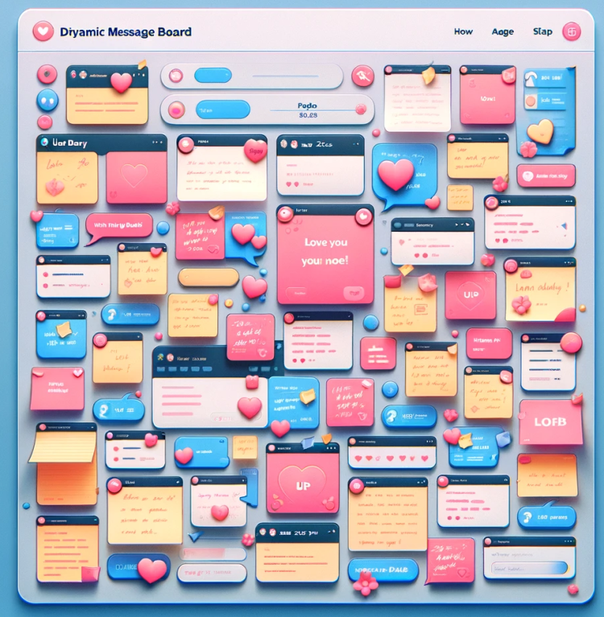

# 项目目标与发展方向

- 一个为情侣提供专属空间，记录和分享他们的恋爱故事、照片和日记的平台。
- 可以基于个人或者基于群体搭建，提供官网或提供个人搭建的方式，并提供完整的搭建服务或搭建文档，让所有人都能轻松的使用这个平台。
- 项目发展前期只面向情侣自己，后续随着项目不断的迭代，项目提供社区功能，部分情侣可以选择展示自己和另一半的空间，让所有人都看到你们的甜蜜。
- 随着技术的不断改进，后续可以考虑上接入AI平台或者大数据分析等功能，为情侣量身定制一些功能。
- 项目保持良好的开放性，项目提供官方邮箱功能，允许情侣向项目开发组（我们）提出一些改进意见，并允许他们加入到我们团体中来。
- 项目发展良好，则可以考虑再项目中开展一些增值服务，比如高级定制、广告合作等。

1.0项目原型图

[Towelove 1. 0版本](http://love.np4.cn/)

2.0项目原型图

# UI设计

## 初次访问与登录注册

用户初次访问页面的时候，处于未登录未注册的状态，此时头像位置处显示初始状态，

也就是用于展示登录注册按钮与界面，如下图。 这一块的技术实现会由前端和后端同学负责，

UI只需要负责实现在用户登录注册之后在这里换为登录态UI即可。 

## 注册/登录完毕

注册完毕之后，当前用户想必自然还没有邀请另一半，此时，注册登录位置处UI改变，

改为展示用户头像，并且另一个头像处展示爱心，用户邀请另一半。 如下图 

## 功能侧

功能测这边包含了项目的主要功能，例如照片、恋爱日记、相册、TimeLIne等功能。

 其他暂时还没有开发的功能，可以考虑用 一把锁锁住一个爱心的情况来进行。

### 签到

icon大致如下 

每一个爱心里面都会显示当前天数的日期，以及上面会显示白色的星期几。

 当用户签到后，爱心数字上会出现粉色爱心，若没有签到日期已过，

则显示黑色破碎爱心。 默认没有签到时，只展示爱心中的数字。

每次进行签到都会获得1的爱意值，由开发完成。

### 恋爱相册

UI是一本相册，然后鼠标悬浮时相册会进行翻页打开。技术由前端实现，提供gif即可。

 点击之后，跳转页面，进入全新页面，UI展示大致如下，

相册按照时间日期进行排序，并可以选择一张照片作为封面，相册展示创建时间以及相册title标题。 

### 恋爱日记

UI可以考虑一张纸，上面是一把羽毛笔。 

然后用户开始输入内容即可。

### 待办列表

大致icon如下 

### TimeLine

时间线这个功能的灵感来自于我朋友 

[时间线参考网站](https://www.bjyxszd.com/timelines)

不知道为什么我认为时间线的icon可以考虑和流星雨有关。

### 恋爱邮局

邮局的功能自然就是发送邮件了。 

点击icon之后进行弹框，提供两个选项
1：写给未来的你
2：每一天你都在我心里

两个选项的区别在于写给未来的你中信件的内容将在未来的某一天发送到对方手中。
第二个选项则是一日三次的日常播报。
可以再早中晚进行三次的发送，发送的内容不重样，每一个时间段的内容都可以自定义，并且也支持让你自定义发送的时间。如下是我当初实现的效果。

先来一个写给未来的你

然后就是一天发送三份的那个。
感觉可以搞一个滚动框，每一个框进行单独的时间配置，唯一不一样的只是上面的发送时间不一样。

### 留言板

留言板的icon 

留言板点击之后直接可以开始留言，
留言板左上角展示用户头像，右上角展示留言时间。
中间展示留言文本。
用户不断的会添加留言板上的内容，留言板上有一张又一张的便签，便签上面就是给对方的留言。然后如果这一页的便签满了，可以点击左下角和右下角进行下一页。
同时，每一张便签都会随意的出现在页面上，不固定。

### 关于我们

关于我们用来简单的记录我们是如何相遇相知相识相恋的。 

点击后就是一页纸，用户双方共同书写内容即可。

# 功能设计

## 基本功能

### 账户管理

#### 注册

注册方面，提供基于手机号、基于邮箱号、基于第三方授权的注册方式，比如微信、QQ等。
项目早期为了控制成本暂时先使用基于邮箱号的注册，但是再注册页面上，需要预留微信、QQ这种第三方注册的图片UI。
注册默认提供基于邮箱和手机号的注册，注册需要用户提供如下信息：
邮箱/手机号接收验证码。
用户名、密码、性别。（支持用户名重复）
大致UI如下，提供二选一，并在下方提供微信和QQ的按钮支持第三方信息注册即可，接口路径可以先预留，后续再进行使用。

#### 登录

登录可以使用基于邮箱号的登录也可以使用基于电话号码的登录，依旧是二者二选一。
也可以选择基于用户名和密码的登录。项目Cookie长期保存，减少不必要的登录。
UI参考如上。

#### 个人信息设置

个人信息点击项目中间的头像即可查看和编辑自己的信息

点击进入之后允许编辑：
用户名、密码、头像、
绑定邮箱号、绑定手机号、绑定微信和QQ（后续功能）
用户如果需要开启定时发送邮件功能，同时还需要在邮箱侧开启SMTP服务。（后续会有教程）
大致UI如下：

邀请我的另一半
点击加号后发送特定的邮件和短信内容，来邀请另一半，这里使用短链接方式实现，也就是类似于淘宝链接那样子的短链接，对方点击链接之后会进入到项目首页并且需要判断被邀请人是否在当前网站注册过，这里可以考虑从cookie或者其他方式获取，如果注册过我们会将用户信息存储在cookie中。
如果cookie存在，则说明已经登录，那么弹出是否同意成为另一半的按钮即可。
耍个花招，这里能用这个平台的估计大部分都是已经是情侣的人了，所以这里按钮可以是：同意，勉为其难同意。
当对方同意之后，系统再次发送邮件给发送邀请的人，通知他对方已经同意。

签到
签到是一个很常规的增加用户粘性的东西，签到可以选择提供一些 爱心， 作为项目的积分，积分可以在后续用于提供额外的功能。并且成为情侣的双方共享 爱心，而不是单方的。

选择和TA坠入爱河的那一天
发送完毕邀请之后，成为情侣后默认选择今天为情侣，但是可以在首页上的展示相恋的天数哪里设定：两个人在一起的日期，然后会重新记录两个人在一起的日期。
滚动字幕
这是我们目前的第一版原型图，可以考虑在这个位置添加一个滚动的字幕。
比如xxx在一起多少天，然后可以编辑字幕的内容，然后字幕会一段时间换一条内容，默认时展示：
今天是我们在一起的第xxx天。

#### 额外功能

找回密码、修改密码

## 核心功能

### 恋爱相册

1. **首页展示**：
    - 当用户点击进入恋爱相册后，可以首先展示一个吸引人的封面图片，这张图片可以是用户自选的，或者是系统自动生成的代表性照片。
    - 封面图片下方提供简短的配文区域，用户可以自定义文本来描述他们的故事或感情。
    - 封面图片的一角或者下方适当的位置展示相册的生成时间，可以用较小但清晰的字体标注。
2. **相册内部设计**：
    - 九宫格布局用于展示相册中的9张照片。这种布局简洁而有效，方便用户一目了然地看到所有图片。
    - 每张照片可以点击放大查看，并且允许用户为每张照片单独添加描述或注释。
    - 九宫格的上方，就是整个相册的描述区域。这部分可以设计成稍微宽敞的文本区域，让用户有足够的空间来表达他们的故事或情感。
    - 相册创建时间可以放在标题的右下方，与首页相似的布局，保持一致性和美观。

恋爱相册是项目最核心和基础的功能。
页面效果大概如下，首先就是点击恋爱相册之后进行跳转，然后展示首页图片，同时提供配文和相册生成时间。大概如下

每一个独立的相册都允许上传最多9张照片。
点进相册之后，展示所有图片，也就是相册的具体内容。
并且可以选择一张作为这个相册的封面，也就是下图左上角。

### 日记功能
双方看不到对方的，但是可以写下来信件内容，然后可以选择写完之后，以信件的方式发送给对方让对方在项目里面看到。比如对方登录之后，发现有信件，信件就会自动打开。然后呈现内容。
需要考虑到使用消息通知机制，在对方登录页面后进行弹出，同时也需要考虑到如何预留下这样的一张图片，方便用户后续进行回忆。
如下是写信页面的大致UI设计。

### 待办列表

待办列表实现简单，就是一行有一行的列表，用于展示情侣们接下来所希望去一起完成的事情。每一行都是情侣想要实现的内容，然后完成之后情侣可以对这一行内容进行打勾，然后再次点开这一行内容，允许情侣上传对于这件事情最具有代表性的一张照片和对这件事情的评价和日期。

### TimeLine

TimeLine也就是时间线，时间线的作用就是用来记录情侣之间在什么时间节点，最有价值最值得记录的事情，比如在一起一个月，在一起半年，在一起一年等等。时间线采用类似于竖线下来但是左右各有事件节点的方式来设计。她就像一棵树，随着情侣之间经历事情的增多，不断有新的叶子长出。
下图过于复杂了，但是大概意思差不多。

### 恋爱邮局

恋爱邮局是项目最核心的功能，它的作用就是提供给情侣编写定时发送的邮件，邮件中的内容可以供情侣们表达对对方的感情，编写完毕邮件内容之后，邮件将会以邮箱的方式将内容原封不动的发送到对方的邮箱中。
邮局支持两种方式，一种是之发送一次的信件。
另一种是发送定时信件，并且按照cron表达式来执行，比如一周一次，每天一次。并且支持设定具体的时间点，比如我当初使用的时候。
就设定早上七点、中午十二点、晚上六点都会定时发送，并且可以设定不同时间节点发送的消息内容是不一样的。
因此UI方面大概是提供两个选项：
第一个选项：只发送一次，那么直接类似直接使用恋爱日记功能里面的UI就好了，就类似于写一份信一样。这封信只发送一次。
这种选项如果后续有可能的话，可以接入第三方邮寄平台，这个我有认识的渠道，写信的内容可以真的以图片打印的方式第三方寄出。
并且我们提供卡纸（当然，这是很后来很后来的想法了）

第二个选项：定时发送并且发送多次，比如像我下面的一天发送三次的。

发送三次的这个直接在一个表单中分为三个模块即可，每个模块隔离，保存提交的时候分为三次提交，也就是说支持对于其中某一个模块的单独的修改。减少请求长度。
如下是第二种：

同时，这一块还提供城市天气提醒功能，为对方选择对方城市并且精确到区的地址，就可以提供
每日一条的为对方发送对方城市所在的天气的信息了。

### 留言板
留言板点击之后直接可以开始留言，
留言板左上角展示用户头像，右上角展示留言时间。
中间展示留言文本。

### 关于我们
关于我们用来简单的记录我们是如何相遇相知相识相恋的。

## 暂不实现

### 记忆浪潮

获取用户上传的所有的相册信息，以及文案信息，生成对应的类似于网易云音乐那样子的年度总结一样的长图片。
思考ing

### 小游戏

思考ing

### 情感曲线

思考ing

### 情感地图

标记共同旅行或重要地点的地图。
思考ing

### 社区功能

相册提供了是否公开的选项，项目如果有幸不断迭代，后续会出现公共社区，
可以浏览所有公开了相册的人的信息。

# 后续迭代设计：

- 可以提供一些简单的编辑工具，让用户可以自定义相册的封面、布局等，增加互动性和个性化体验。
- 也可以考虑加入一些特别的功能，如纪念日提醒、情侣互动小游戏等，增加用户黏性。
- 既然是恋爱主题，可以使用柔和的粉色调、暖色调或者是浪漫的色彩搭配。
- UI元素（如按钮、字体、边框等）可以采用圆润、柔和的设计，以符合恋爱的温馨氛围。

